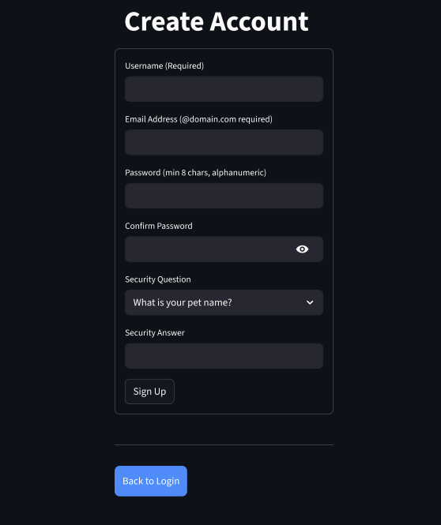
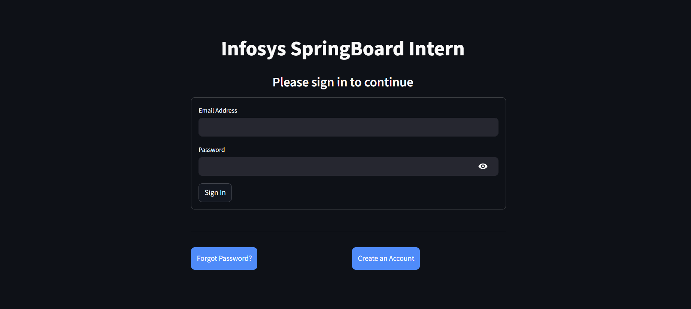
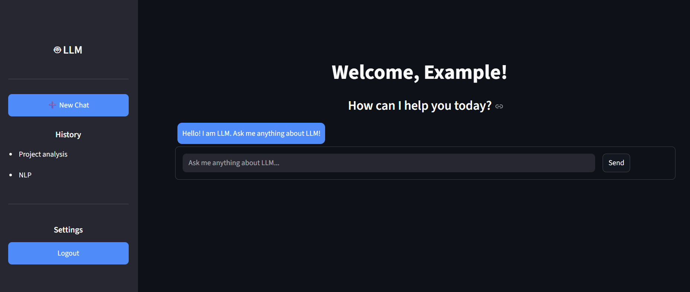
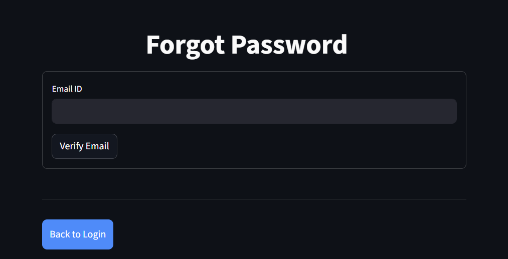
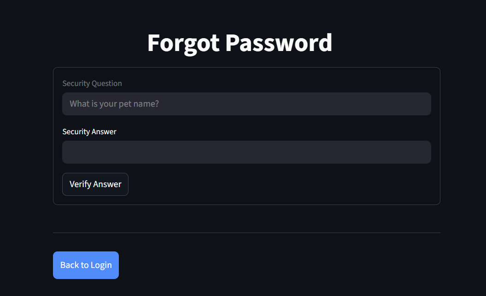
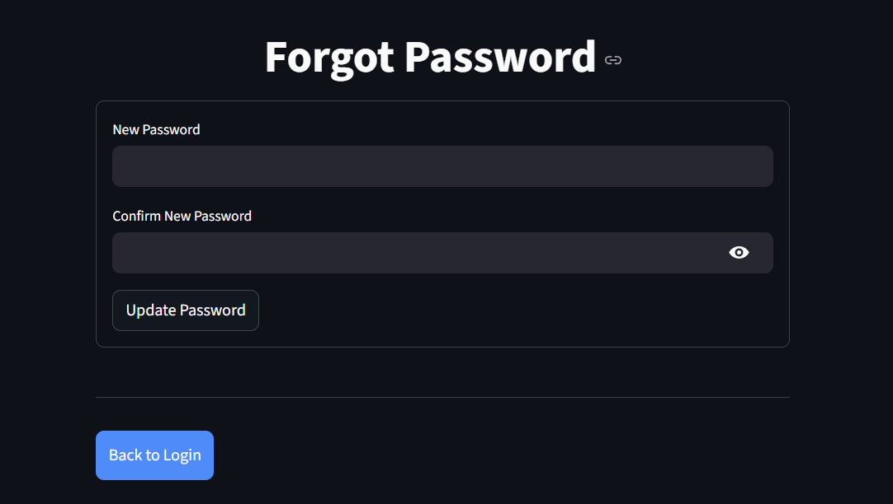

# Milestone 1 – User Authentication System

## Project Title
**PolicyNav – Public Policy Navigation Using AI**

## Description
In this milestone, we designed and implemented a secure User Authentication System using Streamlit, JWT, ngrok, and SQLite.

The system allows users to register, log in, and securely access a protected dashboard.  
It also provides a complete forgot-password mechanism using security questions for identity verification.

This authentication module will serve as the foundation for future AI-powered public policy search and summarization features in PolicyNav.

## Technologies Used
- Python  
- Streamlit  
- SQLite Database  
- JWT (JSON Web Token)  
- Ngrok  

---

## Features Implemented
- User Signup with validations  
- Email format verification  
- Alphanumeric password enforcement  
- Confirm password matching  
- Security question & answer storage  
- Secure login using database verification  
- JWT token generation with expiry  
- Dashboard after authentication  
- Logout functionality  
- Forgot password with:
  - Email verification  
  - Security question validation  
  - Password reset  
- Public URL generation using ngrok  

---

## Database Structure
The system maintains a users table containing:

- Username  
- Email (Primary Key)  
- Password  
- Security Question  
- Security Answer  

This ensures persistent and structured storage of user credentials.

---

## How to Run the Application (Colab)

### Step 1 – Install dependencies
Run the install cell in the notebook.

### Step 2 – Create the Streamlit application
Execute the cell that writes the `app.py` file.

### Step 3 – Start the server
Run the final cell to launch Streamlit.

### Step 4 – Expose using ngrok
A public URL will be generated. Open it in your browser.

## How to Get Ngrok Auth Token

1. Visit **https://ngrok.com/**  
2. Create a free account and log in.  
3. Go to the dashboard.  
4. Copy your **Authtoken**.  
5. In the Colab cell, paste it:

---

## Application Flow
1. User signs up with required details.  
2. Data is stored in SQLite.  
3. During login, credentials are verified.  
4. If valid, JWT token is generated.  
5. User is redirected to the dashboard.  
6. If password is forgotten, identity is verified via security question and password is reset.

---

## Screenshots

### Signup Page

### Login Page

### Dashboard

### Forgot Password Page

 

---

