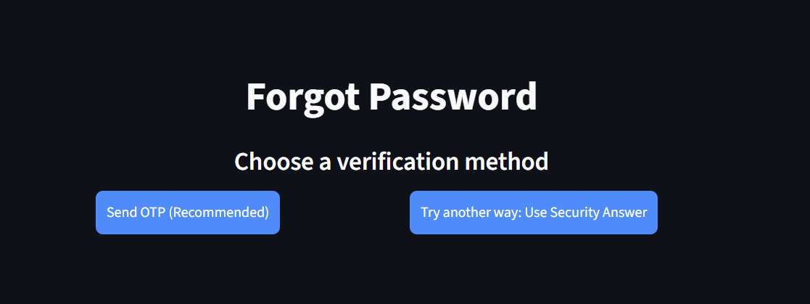
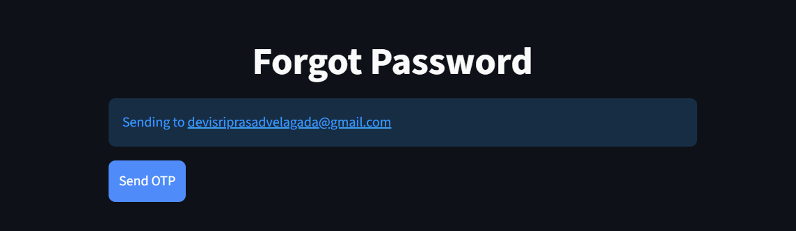
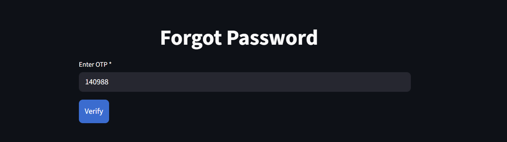
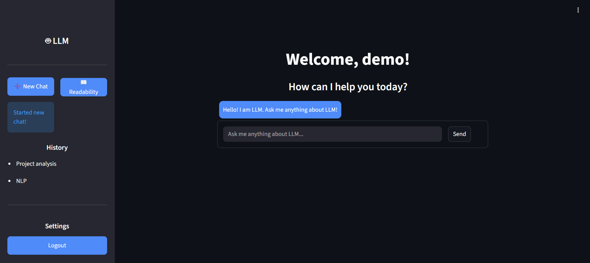
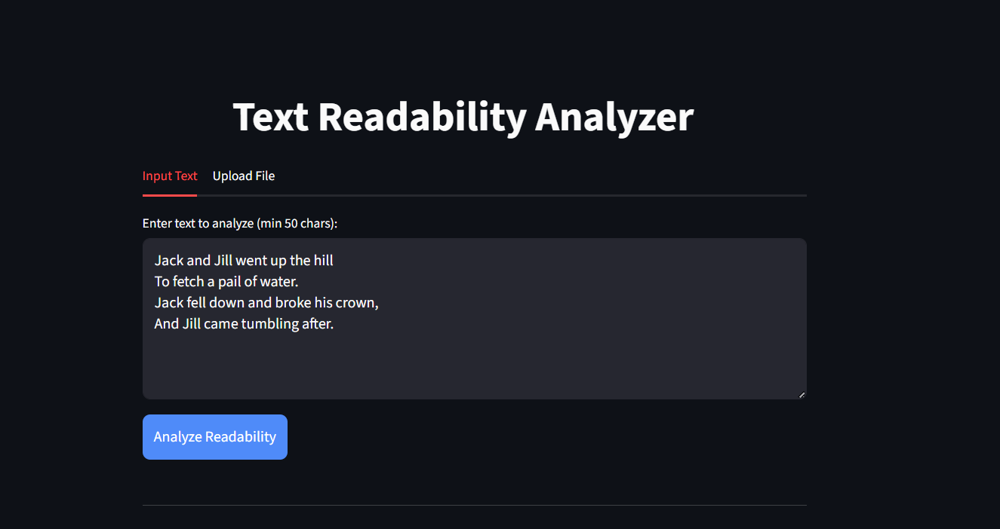
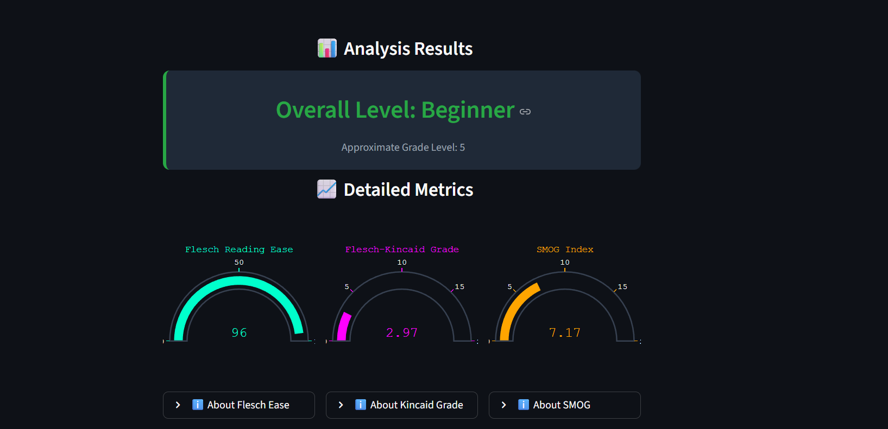
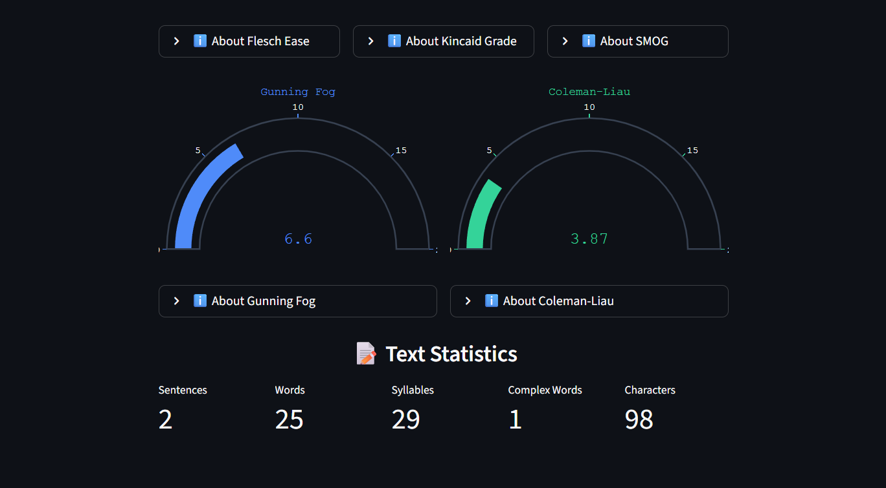
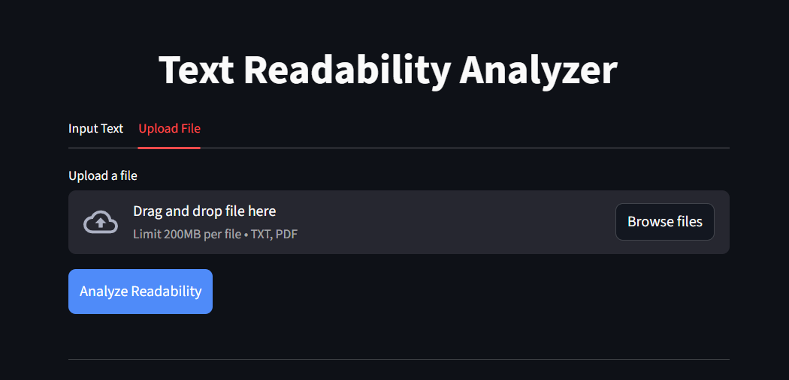
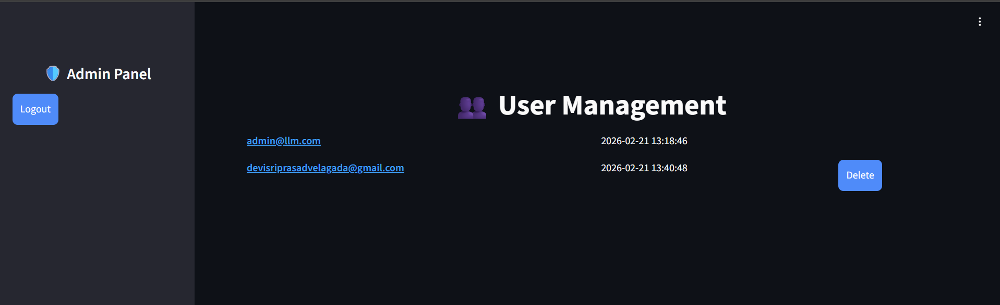

# Milestone 2 – OTP Authentication & Readability Dashboard

## Project Title
**PolicyNav – Public Policy Navigation Using AI**

## Description

In Milestone 2, we enhanced the authentication system by implementing:

- Email-based OTP Authentication
- Secure Secret Key Management
- Admin Login
- Readability Dashboard for text analysis

This milestone improves security by introducing two-factor verification and adds analytical capabilities for evaluating public policy documents.

## Technologies Used

- Python  
- Streamlit  
- SQLite  
- JWT (JSON Web Token)  
- Ngrok  
- SMTP (Gmail for OTP)  
- Text Readability Analysis  

## Features Implemented

### 🔐 OTP Authentication
- OTP is generated after login.
- OTP is sent to the user's registered email.
- User must verify OTP before accessing the dashboard.
- OTP expires after a limited time for security.

### 🔑 Secure Secret Key Handling
All sensitive credentials are stored securely using Google Colab Secrets.

### 👤 Admin Login
- Separate admin authentication.
- Admin credentials stored securely.
- Admin dashboard access control.

### 📊 Readability Dashboard
The Readability Dashboard analyzes policy text and displays multiple readability metrics:

- **Flesch Reading Ease** – Measures how easy a text is to read; higher scores indicate simpler content.
- **Flesch–Kincaid Grade Level** – Estimates the U.S. school grade level required to understand the text.
- **SMOG Index** – Predicts the years of education needed to comprehend the text.
- **Gunning Fog Index** – Estimates the formal education level required to understand the text on first reading.
- **Coleman–Liau Index** – Calculates readability based on characters per word and words per sentence.

The dashboard also displays word count and sentence count for additional analysis.

## Secret Keys Required

The following secrets must be configured in Google Colab:

• JWT_SECRET_KEY  
• NGROK_AUTHTOKEN  
• EMAIL_ID  
• EMAIL_APP_PASSWORD  
• ADMIN_EMAIL_ID  
• ADMIN_PASSWORD  

# 🔐 How to Add Secrets in Google Colab

Open the notebook in Google Colab.  

Click the “Secrets” (key icon) in the left sidebar.  

Select “Add new secret”.  

Enter the secret name and its value exactly as required.  

Save the secret and ensure it is enabled for notebook access.

# 🔐 How to Generate Gmail App Password

Go to Google Account Settings → Security.  

Enable 2-Step Verification (required before creating app passwords).  

Search for “App Passwords” and open it.  

Enter a name for the app and generate the password.  

Copy the generated 16-digit app password immediately and paste it into EMAIL_APP_PASSWORD inside Colab Secrets.  

Do NOT use your normal Gmail password.  

After closing the app password window, you cannot view it again, so make sure you copy and paste it before clicking Done.

# 📊 Application Flow

1. User logs in with email & password.
2. System verifies credentials from database.
3. OTP is generated and sent to registered email.
4. User enters OTP.
5. Upon successful verification:
   - JWT token is generated.
   - User is redirected to dashboard.
6. Readability dashboard analyzes text input and displays readability metrics.

# 📸 Screenshots

### OTP Verification Page

### User Dashboard

### Readability Dashboard

### Admin Login Page

# 🚀 How to Run the Application

1. Open the Colab notebook.  
2. Install required libraries.  
3. Add secret keys in Colab Secrets.  
4. Run the Streamlit app.  
5. Start ngrok tunnel.  
6. Open the generated public URL.

# 👨‍💻 Author
Infosys Springboard Virtual Internship – Batch 13

